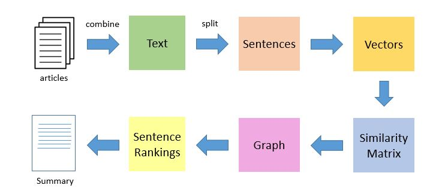

# NLPSummarizer
Uses Natural Language Processing (NLP) to be able to take in large sums of text and create a short summary from it.

# Motivation
Reading through long/multiple articles is time consuming especially if you only want the main idea. Summarizing text and perserving the key sentences and meaning of the content is key.

# Algorithms

Two ways 
1. Abstractive Summarization - Correlated to when a human reads a paper and summarizes in him/her own words
2. Extractive Summarization - Extract sentences with the highest rank (unsupervised learning - learns patterns from un labeled data)

# Extractive Summarization (unsupervised learning)
Identifies important sentences from an article and extracts only those to create a summary.

Many sentences -> extractive summarization -> few sentences

### Approach

### Understanding PageRank Algorithm
Derived from PageRank Algorithm to rank webpages.

| Webpage  | Links |
| ------------- | ------------- |
| w1  | [w2,w3]  |
| w2  | []  |
| w3  | [w1]  |
| w4  | [w2,w6]  |
| w5  | [w5,w6]  |
| w6  | [w4]  |

nodes without links are dangling pages.
webpages have links to another webpage.

|    | w1 | w2 | w3 | w4 | w5 | w6 |
| -- | -- | -- | -- | -- | -- | -- |
| w1 |    |    |    |    |    |    |
| w2 |    |    |    |    |    |    |
| w3 |    |    |    |    |    |    |
| w4 |    |    | hi |    |    |    |
| w5 |    |    |    |    |    |    |
| w6 |    |    |    |    |    |    |

Each cell denotes the probability of a user transitioning from one link to another.
At coordinates 4, 3, the probability of transitioning from 4 to 3. (e.g. P(w4 to w3))

If there is no link, probability is 0. Otherwise it is 1/number of unique links in web page wi

### Implementation of TextRank Algorithm
We use PageRank concepts in the TextRank Algorithm like so.
1. Sentences are used instead of webpages
2. similarity between two sentences is kind of like webpages transitioning
3. similarity scores are held inside a square matrix

1. All text from given article(s)
2. Split text into individual sentences
3. vectorize each sentence
4. cosine similiarities between each vector will be calculated and stored in the square matrix
5. Transformed into a graph representation - sentences as vertices and edges as similarity scores
6. Number of top ranked sentences are formed in the final summary ... graph theory article https://www.analyticsvidhya.com/blog/2018/09/introduction-graph-theory-applications-python/

### Limitations to my single document summarization algorithm

# Abstractive Summarization
A summary in the machine's own words. The words may not be present in the original text at all. 

Reference when building - https://www.analyticsvidhya.com/blog/2019/06/comprehensive-guide-text-summarization-using-deep-learning-python/

Many sentences -> abstractive summarization -> new sentences

# Other places to explore
1. Extractive Summarizing Using BERT - https://towardsdatascience.com/extractive-summarization-using-bert-966e912f4142

This is a supervised learning model and uses our unsupervised model as a baseline and out performs it.

2. Multiple Domain Text Summarization (multiple input documents)
3. Source text in one language and summary in another language
4. Abstractive Summarization 